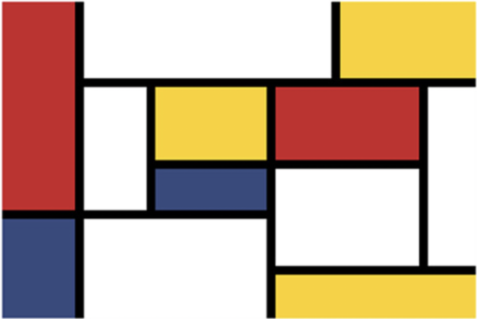
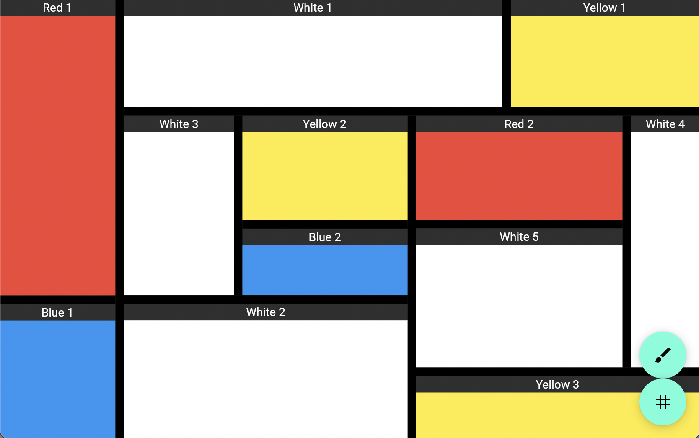

# Mondrian - Tiling Window Manager for Flutter

The `MondrianWidget` from this package takes in a `MondrianTree` containing `MondrianTreeBranch`es, `MondrianTreeTabLeaf`s and `MondrianTreeLeaf`s.
Inside the widget, this tree is then resolved to nested columns and rows which the user can resize, move, tab & un-tab, delte and add to.

The tree is also serializable to a map of the form `Map<String,{Map|List|Set|String}>`.
This can be used to store the tree e.g. as `JSON` or [`SmallRead`](https://github.com/ltOgt/sr-dart).

The tree itself does not contain any `Widget`s, but instead `MondrianTreeLeafId`s that you can resolve to `Widget`s via `MondrianWidget`s `leafBuilder: (leafPath, leafId) => ...`.


## Example
Take a look at `example/lib/main.dart` for the source code to the example that you can try [here](https://omnesia.org/flutter_showcase/mondrian/#/)

A reduced version can be seen in the collapsed section below:
<details>
<summary>Reduced Version of Example</summary>

```dart
// WIDGET
MondrianWidget(
  tree: mondrianExampleTree,
  resizeDraggerWidth: 10.0,
  resizeDraggerColor: Colors.black,
  onUpdateTree: (tree) {
    setState(() {
      mondrianExampleTree = tree;
    });
  },
  buildLeafBar: (leafPath, leafId) {
    return Container(
      color: Colors.black.withAlpha(5),
      child: Center(
        child: AutoSizeText(
          text: leafId.value,
        ),
      ));
  },
  buildTargetDropIndicators: MondrianWidget.defaultBuildTargetDropIndicatorsGenerator(
    const DecoratedBox(decoration: BoxDecoration(color: Color(0xAA000000))),
  ),
  buildLeaf: (leafPath, leafId) {
    return Container(
      color: mondrianExampleColors[leafId],
    );
  },
  onMoveLeafStart: (path) {
    setState(() {
      isLeafMoving = true;
    });
  },
  onMoveLeafEnd: (path) {
    setState(() {
      isLeafMoving = false;
    });
  },
)

// TREE
var mondrianExampleTree = MondrianTree(
  rootAxis: MondrianAxis.horizontal,
  rootNode: MondrianTreeBranch(
    fraction: 1,
    children: [
      // red blue
      MondrianTreeBranch(
        fraction: 1 / 6,
        children: [
          MondrianTreeLeaf(fraction: 2 / 3, id: MondrianTreeLeafId("Red 1")),
          MondrianTreeLeaf(fraction: 1 / 3, id: MondrianTreeLeafId("Blue 1")),
        ],
      ),
      // rest
      MondrianTreeBranch(
        fraction: 5 / 6,
        children: [
          // White Yellow
          MondrianTreeBranch(
            fraction: 1 / 4,
            children: [
              MondrianTreeLeaf(fraction: 2 / 3, id: MondrianTreeLeafId("White 1")),
              MondrianTreeLeaf(fraction: 1 / 3, id: MondrianTreeLeafId("Yellow 1")),
            ],
          ),
          // Rest
          MondrianTreeBranch(
            fraction: 3 / 4,
            children: [
              // YELLOW BLUE PPPARENT
              MondrianTreeBranch(
                fraction: 1 / 2,
                children: [
                  // YELLOW BLUE PPARENT
                  MondrianTreeBranch(
                    fraction: 4 / 7,
                    children: [
                      // WHITE
                      MondrianTreeLeaf(fraction: 2 / 5, id: MondrianTreeLeafId("White 3")),
                      // YELLOW BLUE PARENT
                      MondrianTreeBranch(
                        fraction: 3 / 5,
                        children: [
                          // YELLOW
                          MondrianTreeLeaf(fraction: 2 / 3, id: MondrianTreeLeafId("Yellow 2")),
                          // BLUE
                          MondrianTreeLeaf(fraction: 1 / 3, id: MondrianTreeLeafId("Blue 2")),
                        ],
                      ),
                    ],
                  ),
                  // WHITE
                  MondrianTreeLeaf(fraction: 3 / 7, id: MondrianTreeLeafId("White 2")),
                ],
              ),
              // RED YELLOW ANCESTOR
              MondrianTreeBranch(
                fraction: 1 / 2,
                children: [
                  // RED WITH REST
                  MondrianTreeBranch(
                    fraction: 4 / 5,
                    children: [
                      // RED WHITE
                      MondrianTreeBranch(
                        fraction: 3 / 4,
                        children: [
                          // RED
                          MondrianTreeLeaf(fraction: 3 / 7, id: MondrianTreeLeafId("Red 2")),
                          // WHITE
                          MondrianTreeLeaf(fraction: 4 / 7, id: MondrianTreeLeafId("White 5")),
                        ],
                      ),
                      // WHITE
                      MondrianTreeLeaf(fraction: 1 / 4, id: MondrianTreeLeafId("White 4")),
                    ],
                  ),
                  // YELLOW
                  MondrianTreeLeaf(fraction: 1 / 5, id: MondrianTreeLeafId("Yellow 3")),
                ],
              ),
            ],
          ),
        ],
      ),
    ],
  ),
);


// COLORS
final mondrianExampleColors = <MondrianTreeLeafId, Color>{
  const MondrianTreeLeafId("Red 1"): Colors.red,
  const MondrianTreeLeafId("Blue 1"): Colors.blue,
  const MondrianTreeLeafId("White 1"): Colors.white,
  const MondrianTreeLeafId("Yellow 1"): Colors.yellow,
  const MondrianTreeLeafId("White 2"): Colors.white,
  const MondrianTreeLeafId("White 3"): Colors.white,
  const MondrianTreeLeafId("Yellow 2"): Colors.yellow,
  const MondrianTreeLeafId("Blue 2"): Colors.blue,
  const MondrianTreeLeafId("Yellow 3"): Colors.yellow,
  const MondrianTreeLeafId("White 4"): Colors.white,
  const MondrianTreeLeafId("Red 2"): Colors.red,
  const MondrianTreeLeafId("White 5"): Colors.white,
};
```
</details>


## Name
The name comes from the durch painter [Piet Mondrian](https://en.wikipedia.org/wiki/Piet_Mondrian).

Here is one of his images:


And a rough recreation with this package:


## Functional Inspiration
The main inspiration for the feature implementation is the window manager inside `VS Code`.

In the future i would like to integrate more features of `i3wm`.